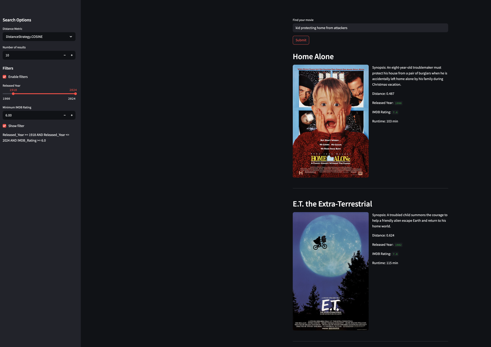

## Movie Search using Couchbase Query Service

This is a demo app built to perform hybrid search using the Vector Search capabilities of Couchbase Query & Index Service. The demo allows users to search for movies based on the synopsis or overview of the movie using the [LangChain Query Vector Store integration](https://python.langchain.com/docs/integrations/vectorstores/couchbase/).

> Note that you need Couchbase Server 8.0 or higher for Vector Search.

### How does it work?

You can perform semantic searches for movies based on the plot synopsis. Additionally, you can filter the results based on the year of release and the IMDB rating for the movie. Optionally, you can also search for the keyword in the movie title.



The hybrid search can be performed using both the Couchbase Python SDK & the LangChain Vector Store integration for Couchbase. Here we show how to use the LangChain integration. We use OpenAI for generating the embeddings.

### How to Run

- #### Install dependencies

  `pip install -r requirements.txt`

- #### Set the environment secrets

  Copy the `secrets.example.toml` file and rename it to `secrets.toml` and replace the placeholders with the actual values for your environment.

  > For the ingestion script, the same environment variables need to be set in the environment (using `.env` file from `.env.example`) as it runs outside the Streamlit environment.

  ```
  OPENAI_API_KEY = "<open_ai_api_key>"
  DB_CONN_STR = "<connection_string_for_couchbase_cluster>"
  DB_USERNAME = "<username_for_couchbase_cluster>"
  DB_PASSWORD = "<password_for_couchbase_cluster>"
  DB_BUCKET = "<name_of_bucket_to_store_documents>"
  DB_SCOPE = "<name_of_scope_to_store_documents>"
  DB_COLLECTION = "<name_of_collection_to_store_documents>"
  INDEX_NAME = "<name_of_search_index_with_vector_support>"
  EMBEDDING_MODEL = "text-embedding-3-small" # OpenAI embedding model to use to encode the documents
  ```

- #### Ingest the Documents

  For this demo, we are using the [IMDB dataset from Kaggle](https://www.kaggle.com/datasets/harshitshankhdhar/imdb-dataset-of-top-1000-movies-and-tv-shows). You can download the CSV file, `imdb_top_1000.csv` to the source folder or use the one provided in the repo.

  To ingest the documents including generating the embeddings for the Overview field, you can run the script, `ingest.py`

  `python ingest.py`

- #### Run the application

  `streamlit run movies_search.py`
